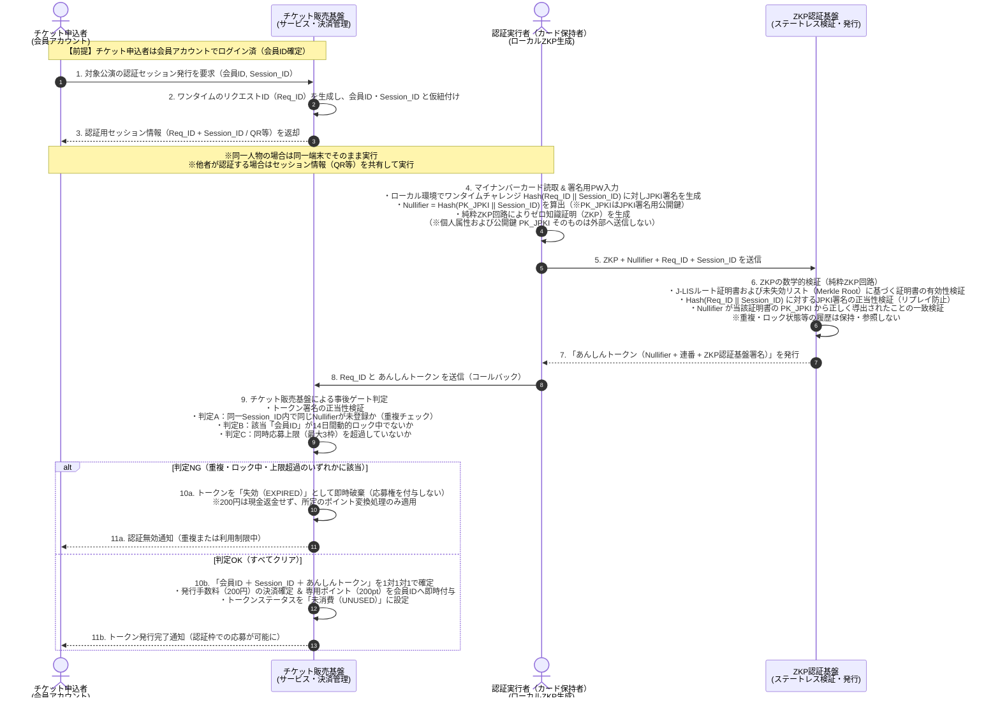

```mermaid
%%{init: {'theme': 'default'}}%%

sequenceDiagram
    autonumber
    actor Applicant as チケット申込者<br/>(会員アカウント)
    participant SalesSys as チケット販売基盤<br/>(サービス・決済管理)
    actor Executor as 認証実行者（カード保持者）<br/>(ローカルZKP生成)
    participant ZkpAuth as ZKP認証基盤<br/>(ステートレス検証・発行)

    Note over Applicant, SalesSys: 【前提】チケット申込者は会員アカウントでログイン済（会員ID確定）

    Applicant->>SalesSys: 1. 対象公演の認証セッション発行を要求（会員ID, Session_ID）
    SalesSys->>SalesSys: 2. ワンタイムのリクエストID（Req_ID）を生成し、会員ID・Session_ID と仮紐付け
    SalesSys-->>Applicant: 3. 認証用セッション情報（Req_ID + Session_ID / QR等）を返却

    Note over Applicant, Executor: ※同一人物の場合は同一端末でそのまま実行<br/>※他者が認証する場合はセッション情報（QR等）を共有して実行

    Executor->>Executor: 4. マイナンバーカード読取 & 署名用PW入力<br/>・ローカル環境でワンタイムチャレンジ Hash(Req_ID || Session_ID) に対しJPKI署名を生成<br/>・Nullifier = Hash(PK_JPKI || Session_ID) を算出（※PK_JPKIはJPKI署名用公開鍵）<br/>・純粋ZKP回路によりゼロ知識証明（ZKP）を生成<br/>（※個人属性および公開鍵 PK_JPKI そのものは外部へ送信しない）

    Executor->>ZkpAuth: 5. ZKP + Nullifier + Req_ID + Session_ID を送信
    ZkpAuth->>ZkpAuth: 6. ZKPの数学的検証（純粋ZKP回路）<br/>・J-LISルート証明書および未失効リスト（Merkle Root）に基づく証明書の有効性検証<br/>・Hash(Req_ID || Session_ID) に対するJPKI署名の正当性検証（リプレイ防止）<br/>・Nullifier が当該証明書の PK_JPKI から正しく導出されたことの一致検証<br/>※重複・ロック状態等の履歴は保持・参照しない
    ZkpAuth-->>Executor: 7. 「あんしんトークン（Nullifier + 連番 + ZKP認証基盤署名）」を発行

    Executor->>SalesSys: 8. Req_ID と あんしんトークン を送信（コールバック）
    SalesSys->>SalesSys: 9. チケット販売基盤による事後ゲート判定<br/>・トークン署名の正当性検証<br/>・判定A：同一Session_ID内で同じNullifierが未登録か（重複チェック）<br/>・判定B：該当「会員ID」が14日間動的ロック中でないか<br/>・判定C：同時応募上限（最大3枠）を超過していないか

    alt 判定NG（重複・ロック中・上限超過のいずれかに該当）
        SalesSys->>SalesSys: 10a. トークンを「失効（EXPIRED）」として即時破棄（応募権を付与しない）<br/>※200円は現金返金せず、所定のポイント変換処理のみ適用
        SalesSys-->>Applicant: 11a. 認証無効通知（重複または利用制限中）
    else 判定OK（すべてクリア）
        SalesSys->>SalesSys: 10b. 「会員ID ＋ Session_ID ＋ あんしんトークン」を1対1対1で確定<br/>・発行手数料（200円）の決済確定 ＆ 専用ポイント（200pt）を会員IDへ即時付与<br/>・トークンステータスを「未消費（UNUSED）」に設定
        SalesSys-->>Applicant: 11b. トークン発行完了通知（認証枠での応募が可能に）
    end
```
