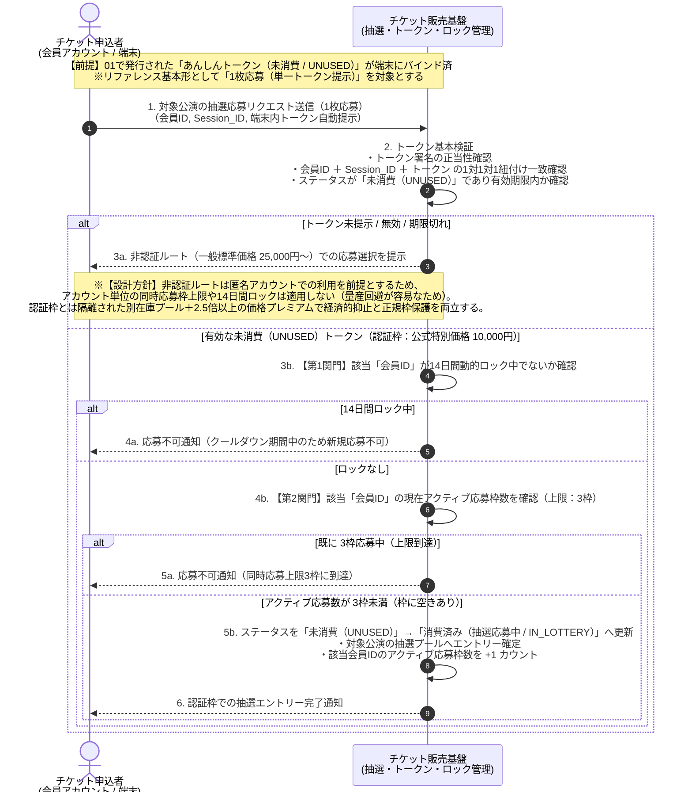

```mermaid
%%{init: {'theme': 'default'}}%%

sequenceDiagram
    autonumber
    actor Applicant as チケット申込者<br/>(会員アカウント / 端末)
    participant SalesSys as チケット販売基盤<br/>(抽選・トークン・ロック管理)

    Note over Applicant, SalesSys: 【前提】01で発行された「あんしんトークン（未消費 / UNUSED）」が端末にバインド済<br/>※リファレンス基本形として「1枚応募（単一トークン提示）」を対象とする

    Applicant->>SalesSys: 1. 対象公演の抽選応募リクエスト送信（1枚応募）<br/>（会員ID, Session_ID, 端末内トークン自動提示）

    SalesSys->>SalesSys: 2. トークン基本検証<br/>・トークン署名の正当性確認<br/>・会員ID ＋ Session_ID ＋ トークン の1対1対1紐付け一致確認<br/>・ステータスが「未消費（UNUSED）」であり有効期限内か確認

    alt トークン未提示 / 無効 / 期限切れ
        SalesSys-->>Applicant: 3a. 非認証ルート（一般標準価格 25,000円〜）での応募選択を提示
        Note over Applicant, SalesSys: ※【設計方針】非認証ルートは匿名アカウントでの利用を前提とするため、<br/>アカウント単位の同時応募枠上限や14日間ロックは適用しない（量産回避が容易なため）。<br/>認証枠とは隔離された別在庫プール＋2.5倍以上の価格プレミアムで経済的抑止と正規枠保護を両立する。
    else 有効な未消費（UNUSED）トークン（認証枠：公式特別価格 10,000円）
        SalesSys->>SalesSys: 3b. 【第1関門】該当「会員ID」が14日間動的ロック中でないか確認

        alt 14日間ロック中
            SalesSys-->>Applicant: 4a. 応募不可通知（クールダウン期間中のため新規応募不可）
        else ロックなし
            SalesSys->>SalesSys: 4b. 【第2関門】該当「会員ID」の現在アクティブ応募枠数を確認（上限：3枠）

            alt 既に 3枠応募中（上限到達）
                SalesSys-->>Applicant: 5a. 応募不可通知（同時応募上限3枠に到達）
            else アクティブ応募数が 3枠未満（枠に空きあり）
                SalesSys->>SalesSys: 5b. ステータスを「未消費（UNUSED）」→「消費済み（抽選応募中 / IN_LOTTERY）」へ更新<br/>・対象公演の抽選プールへエントリー確定<br/>・該当会員IDのアクティブ応募枠数を +1 カウント
                SalesSys-->>Applicant: 6. 認証枠での抽選エントリー完了通知
            end
        end
    end

```
