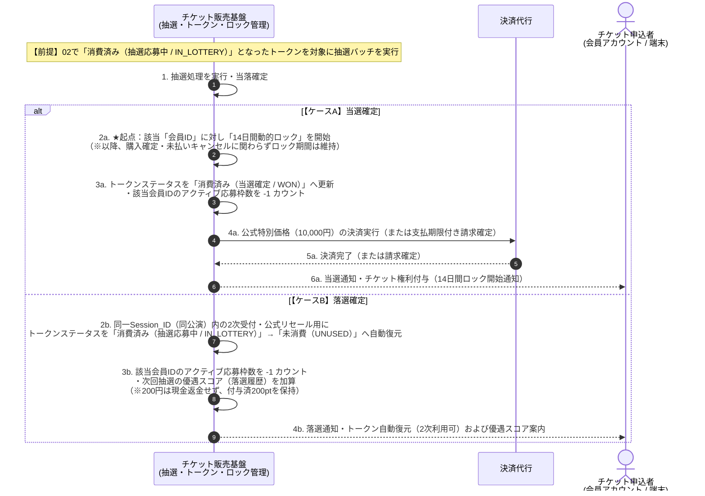

```mermaid
%%{init: {'theme': 'default'}}%%


sequenceDiagram
    autonumber
    participant SalesSys as チケット販売基盤<br/>(抽選・トークン・ロック管理)
    participant Pay as 決済代行
    actor Applicant as チケット申込者<br/>(会員アカウント / 端末)

    Note over SalesSys: 【前提】02で「消費済み（抽選応募中 / IN_LOTTERY）」となったトークンを対象に抽選バッチを実行

    SalesSys->>SalesSys: 1. 抽選処理を実行・当落確定

    alt 【ケースA】当選確定
        SalesSys->>SalesSys: 2a. ★起点：該当「会員ID」に対し「14日間動的ロック」を開始<br/>（※以降、購入確定・未払いキャンセルに関わらずロック期間は維持）
        SalesSys->>SalesSys: 3a. トークンステータスを「消費済み（当選確定 / WON）」へ更新<br/>・該当会員IDのアクティブ応募枠数を -1 カウント
        SalesSys->>Pay: 4a. 公式特別価格（10,000円）の決済実行（または支払期限付き請求確定）
        Pay-->>SalesSys: 5a. 決済完了（または請求確定）
        SalesSys-->>Applicant: 6a. 当選通知・チケット権利付与（14日間ロック開始通知）

    else 【ケースB】落選確定
        SalesSys->>SalesSys: 2b. 同一Session_ID（同公演）内の2次受付・公式リセール用に<br/>トークンステータスを「消費済み（抽選応募中 / IN_LOTTERY）」→「未消費（UNUSED）」へ自動復元
        SalesSys->>SalesSys: 3b. 該当会員IDのアクティブ応募枠数を -1 カウント<br/>・次回抽選の優遇スコア（落選履歴）を加算<br/>（※200円は現金返金せず、付与済200ptを保持）
        SalesSys-->>Applicant: 4b. 落選通知・トークン自動復元（2次利用可）および優遇スコア案内
    end
```
