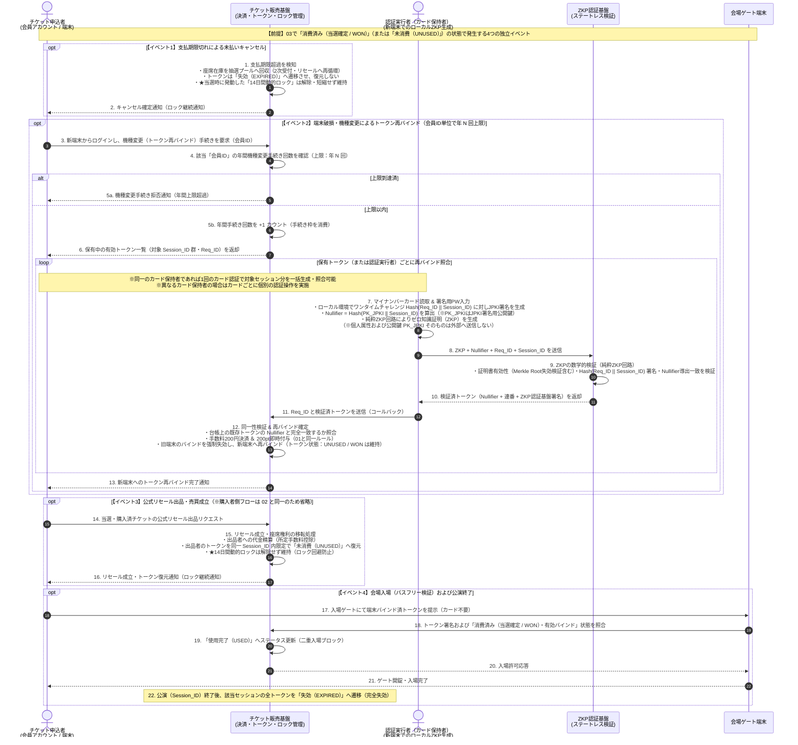

```mermaid
%%{init: {'theme': 'default'}}%%


sequenceDiagram
    autonumber
    actor Applicant as チケット申込者<br/>(会員アカウント / 端末)
    participant SalesSys as チケット販売基盤<br/>(決済・トークン・ロック管理)
    actor Executor as 認証実行者（カード保持者）<br/>(新端末でのローカルZKP生成)
    participant ZkpAuth as ZKP認証基盤<br/>(ステートレス検証)
    participant Gate as 会場ゲート端末

    Note over Applicant, Gate: 【前提】03で「消費済み（当選確定 / WON）」（または「未消費（UNUSED）」）の状態で発生する4つの独立イベント

    %% イベント1：未払いキャンセル
    opt 【イベント1】支払期限切れによる未払いキャンセル
        SalesSys->>SalesSys: 1. 支払期限超過を検知<br/>・座席在庫を抽選プールへ回収（2次受付・リセールへ再循環）<br/>・トークンは「失効（EXPIRED）」へ遷移させ、復元しない<br/>・★当選時に発動した「14日間動的ロック」は解除・短縮せず維持
        SalesSys-->>Applicant: 2. キャンセル確定通知（ロック継続通知）
    end

    %% イベント2：機種変更・端末破損時の再バインド
    opt 【イベント2】端末破損・機種変更によるトークン再バインド（会員ID単位で年 N 回上限）
        Applicant->>SalesSys: 3. 新端末からログインし、機種変更（トークン再バインド）手続きを要求（会員ID）
        SalesSys->>SalesSys: 4. 該当「会員ID」の年間機種変更手続き回数を確認（上限：年 N 回）
        alt 上限到達済
            SalesSys-->>Applicant: 5a. 機種変更手続き拒否通知（年間上限超過）
        else 上限以内
            SalesSys->>SalesSys: 5b. 年間手続き回数を +1 カウント（手続き枠を消費）
            SalesSys-->>Applicant: 6. 保有中の有効トークン一覧（対象 Session_ID 群・Req_ID）を返却

            loop 保有トークン（または認証実行者）ごとに再バインド照合
                Note over Applicant, Executor: ※同一のカード保持者であれば1回のカード認証で対象セッション分を一括生成・照合可能<br/>※異なるカード保持者の場合はカードごとに個別の認証操作を実施
                Executor->>Executor: 7. マイナンバーカード読取 & 署名用PW入力<br/>・ローカル環境でワンタイムチャレンジ Hash(Req_ID || Session_ID) に対しJPKI署名を生成<br/>・Nullifier = Hash(PK_JPKI || Session_ID) を算出（※PK_JPKIはJPKI署名用公開鍵）<br/>・純粋ZKP回路によりゼロ知識証明（ZKP）を生成<br/>（※個人属性および公開鍵 PK_JPKI そのものは外部へ送信しない）
                Executor->>ZkpAuth: 8. ZKP + Nullifier + Req_ID + Session_ID を送信
                ZkpAuth->>ZkpAuth: 9. ZKPの数学的検証（純粋ZKP回路）<br/>・証明書有効性（Merkle Root失効検証含む）・Hash(Req_ID || Session_ID) 署名・Nullifier導出一致を検証
                ZkpAuth-->>Executor: 10. 検証済トークン（Nullifier + 連番 + ZKP認証基盤署名）を返却
                Executor->>SalesSys: 11. Req_ID と検証済トークンを送信（コールバック）
                SalesSys->>SalesSys: 12. 同一性検証 & 再バインド確定<br/>・台帳上の既存トークンの Nullifier と完全一致するか照合<br/>・手数料200円決済 ＆ 200pt即時付与（01と同一ルール）<br/>・旧端末のバインドを強制失効し、新端末へ再バインド（トークン状態：UNUSED / WON は維持）
            end
            SalesSys-->>Applicant: 13. 新端末へのトークン再バインド完了通知
        end
    end

    %% イベント3：公式リセール出品・成立（出品者側）
    opt 【イベント3】公式リセール出品・売買成立（※購入者側フローは 02 と同一のため省略）
        Applicant->>SalesSys: 14. 当選・購入済チケットの公式リセール出品リクエスト
        SalesSys->>SalesSys: 15. リセール成立・座席権利の移転処理<br/>・出品者への代金精算（所定手数料控除）<br/>・出品者のトークンを同一 Session_ID 内限定で「未消費（UNUSED）」へ復元<br/>・★14日間動的ロックは解除せず維持（ロック回避防止）
        SalesSys-->>Applicant: 16. リセール成立・トークン復元通知（ロック継続通知）
    end

    %% イベント4：当日会場入場とセッション終了失効
    opt 【イベント4】会場入場（パスフリー検証）および公演終了
        Applicant->>Gate: 17. 入場ゲートにて端末バインド済トークンを提示（カード不要）
        Gate->>SalesSys: 18. トークン署名および「消費済み（当選確定 / WON）・有効バインド」状態を照合
        SalesSys->>SalesSys: 19. 「使用完了（USED）」へステータス更新（二重入場ブロック）
        SalesSys-->>Gate: 20. 入場許可応答
        Gate-->>Applicant: 21. ゲート開錠・入場完了
        Note over SalesSys: 22. 公演（Session_ID）終了後、該当セッションの全トークンを「失効（EXPIRED）」へ遷移（完全失効）
    end
```
